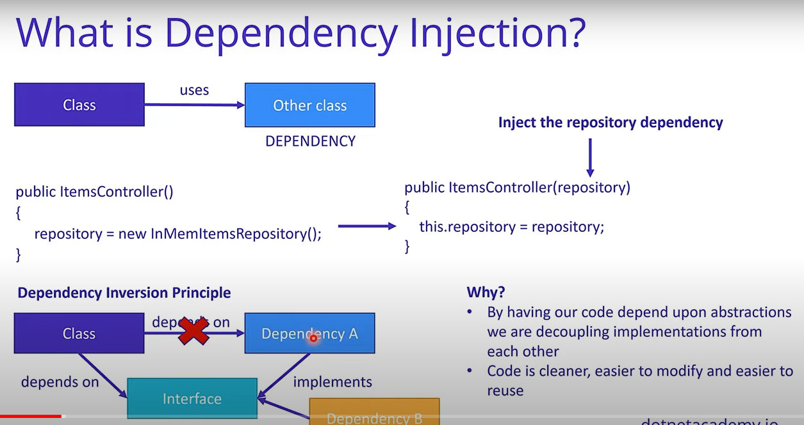

# Fundations

## Part 1

* Entity/Domain/Models - represents the itens in catalog ( via c# record types)
* Repository - resposible for all itens storage related operations (in memory)
* Controller - controls the requests to the api

## Part 2

* Dependency injection is a technique to properly inject our
repository instance with items controller.

* Data transfer objects are used to establish our peer contract with out api consumers (DTOs)

* Classes should not be dependents of other objects, but of interfaces.

* Data Transfer Object: "an object that carries data between processes in order to reduce the number of method calls.

How do we validate DTOs?

So: create the model

Then we keep doig this: repo, add the interface, dto, controller

## Part 3

Now we will connect our service to a MongoDb database, replacing our in memory repository with it.

We will learn:
    1.How to create a MongoDb repository
    2.How to run MongoDb as a docker container
    3.How to use Postman to interact with a REST API

This is only my studyng repo. I do not own this content.

Postman is self-explanatory. It is httprepl with an GUI.

Docker encapsulates everything you need to run your application. Including mongo.

We need to add our localhost and the port on appsettings. We can create a class to put settign inside c# (it can be named either Settings, Configuration or Options).

How Mongo works in c#?

Secret managment: we've got the appsettings, which has our host and port. But, this is not a good ideia to save a password in any file. The way to change it is to tell our api how to handle it.

Ways to manage secrets is: using command line args, env variables and cloud sources.
